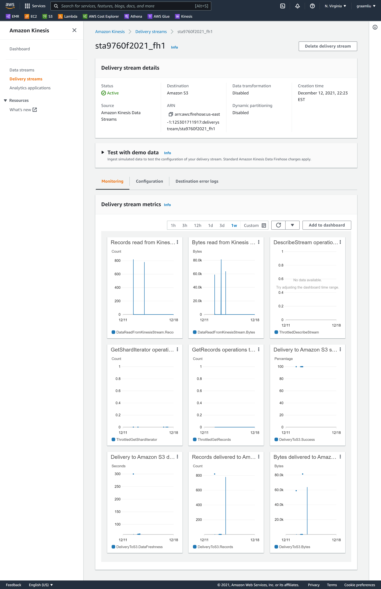

# Streaming Finance Data with AWS Lambda: Graam Liu

Using an AWS Lambda function and [yfinance](https://pypi.org/project/yfinance/), 
historical price information for November 30, 2021 was collected for the stocks below to demonstrate how near real-time financial data could be collected for querying which is interactive. 
 
- Facebook (FB)
- Shopify (SHOP)
- Beyond Meat (BYND)
- Netflix (NFLX)
- Pinterest (PINS)
- Square (SQ)
- The Trade Desk (TTD)
- Okta (OKTA)
- Snap (SNAP)
- Datadog (DDOG)

## Analysis
There are three main components:

1. Infrastructure that Works Together
    1. Created a **DataTransformer** to gather the data using an AWS Lambda function to create S3 files.
    2. Created a **DataCollector** to hold the data using an AWS Kinesis stream and a S3 Bucket. 
    3. Created a **DataAnalyzer** to query S3 data which is a serverless process: using AWS Glue to point  
    to the S3 Bucket built in the DataCollector step and then using AWS Athena to make queries on the data and analyze it. 
    
2. Data Collection
    1. Using the AWS Lambda function and the yfinance module, high and low prices were collected for the aforementioned  
    stocks on November 30, 2021 at 5 minute intervals for a full trading day. 
    
3. Data Analysis
    1. A query was made in AWS Athena to find the highest hourly price by company. 

## Kinesis Config

